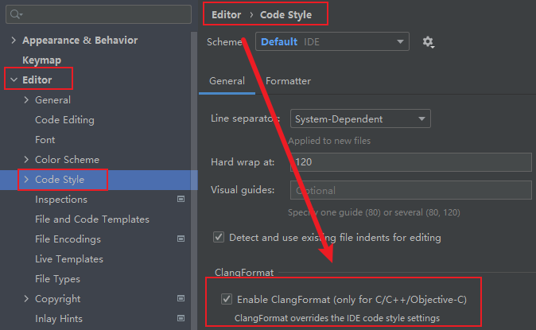
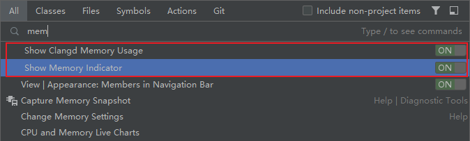

# cpp-std20-achieve

[](https://www.mit-license.org)
[](https://isocpp.org)
[](https://cmake.org/cmake/help/v3.10)
[](https://github.com/aaric/cpp-std20-achieve/releases)

> C++ 20 Lang Learning.

## 1 CLion 

### 1.1 Clang Format



&emsp;&emsp;**New file `.clang-format` sample.**

```text
BasedOnStyle: Microsoft
```

### 1.2 Search Everywhere



&emsp;&emsp;**Double `Shift` click to set.**

